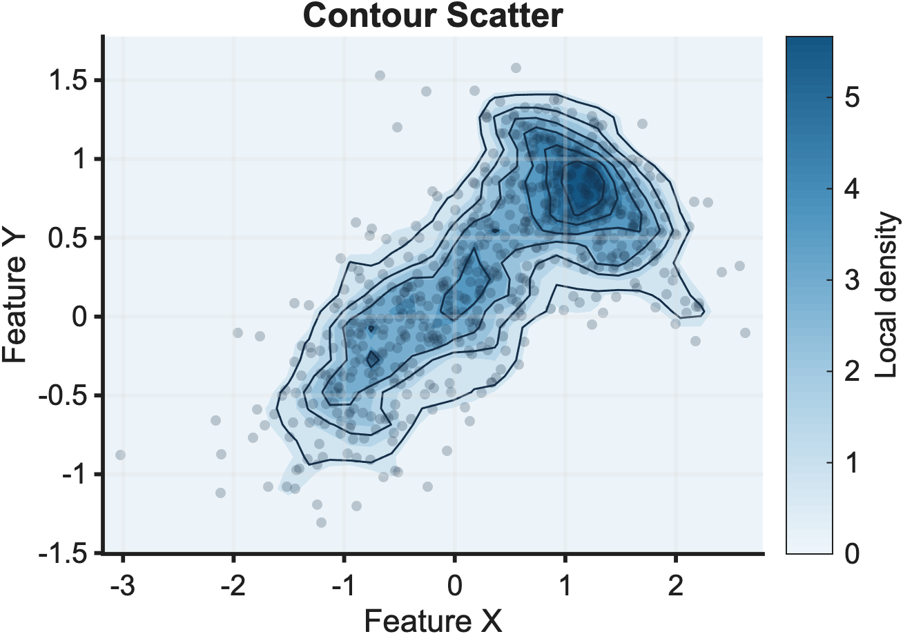
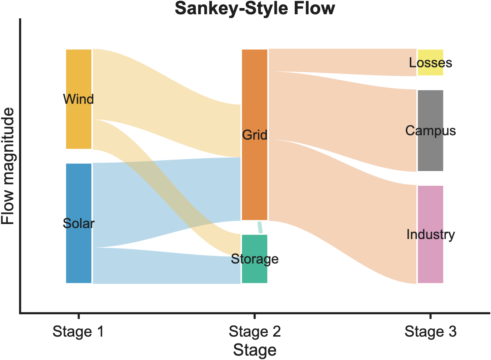
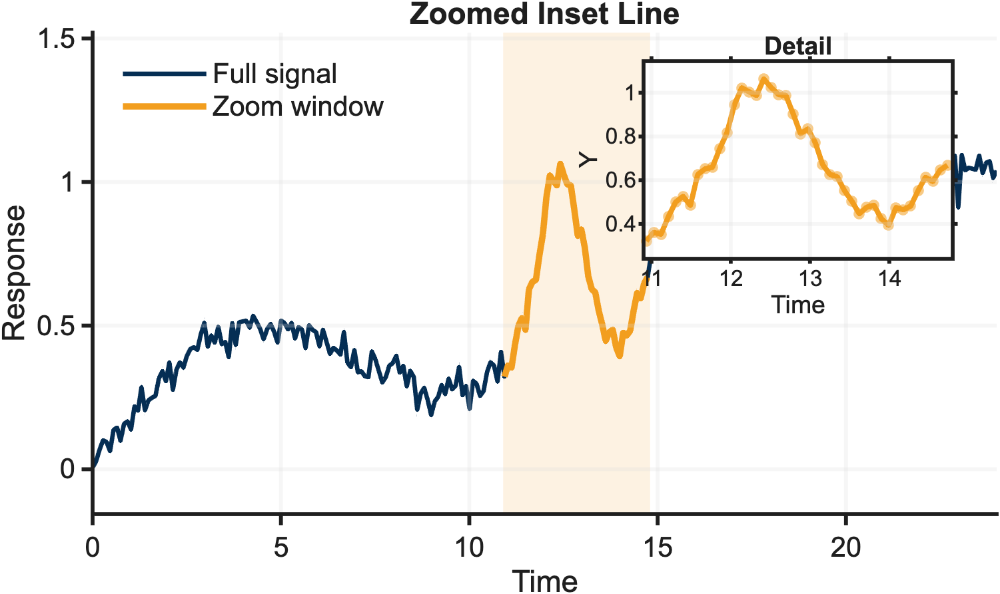
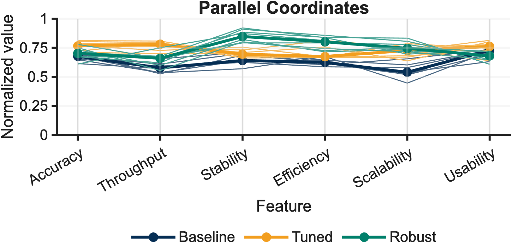
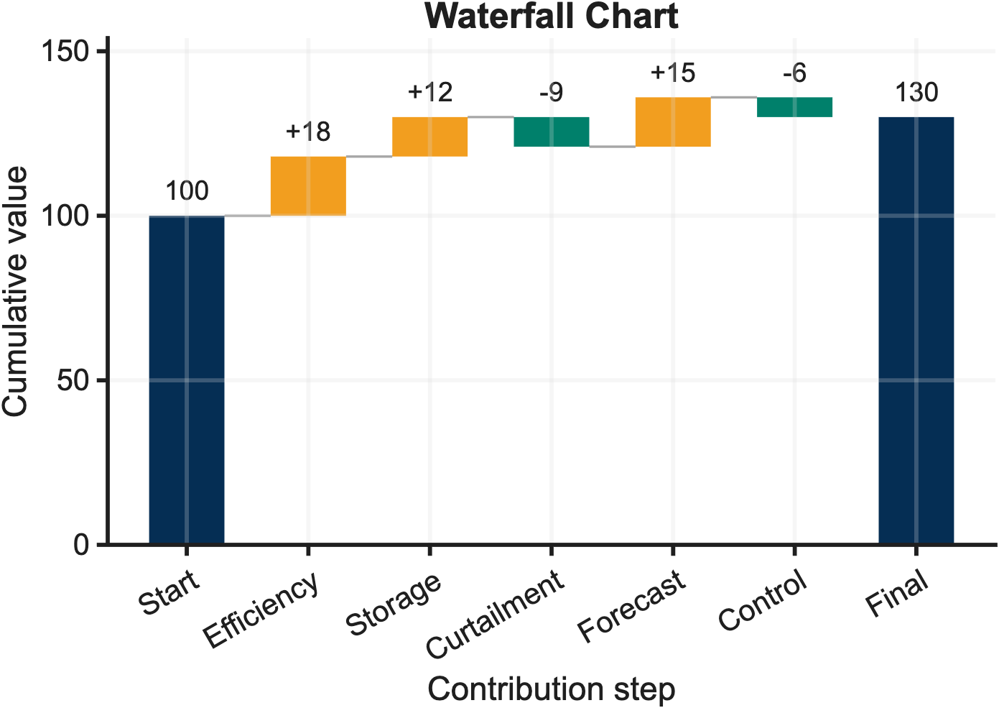
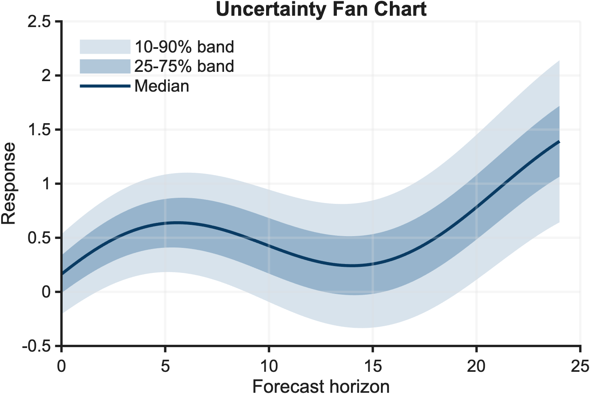
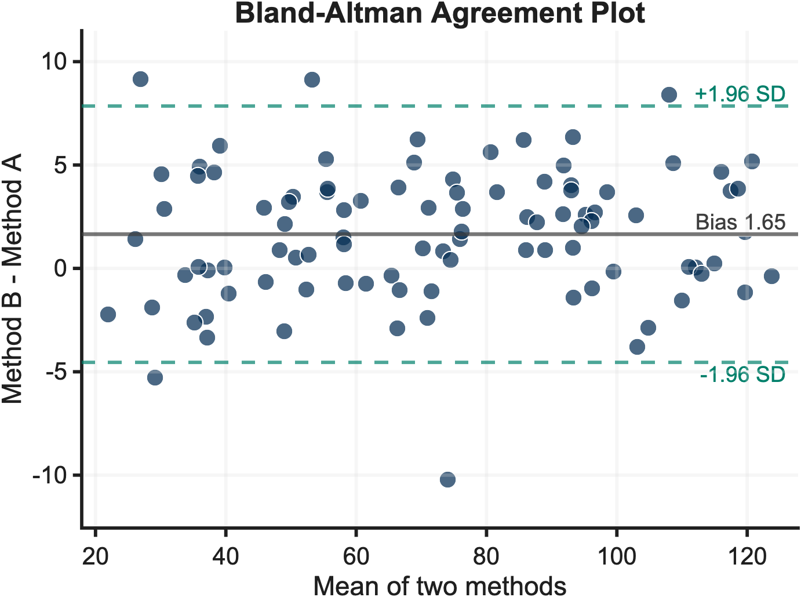
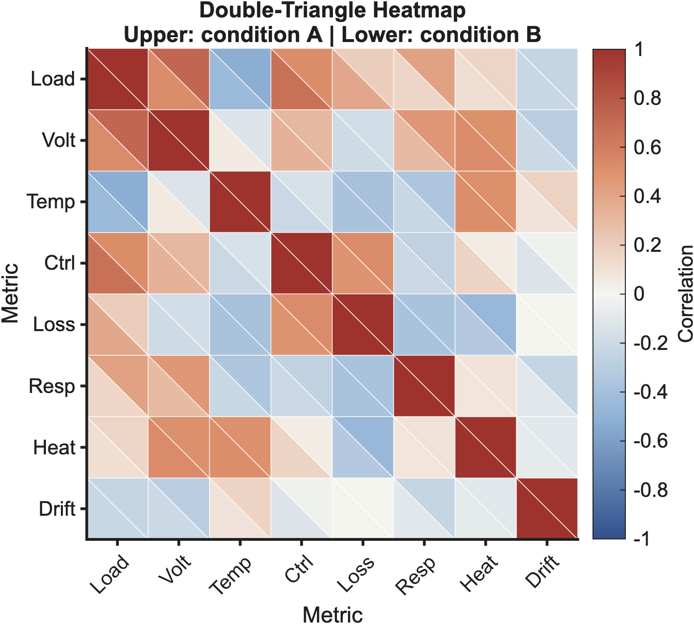

# MATLAB Scientific Figures

[](https://github.com/Kkkakania/matlab-scientific-figures/actions/workflows/quality.yml)
[](https://github.com/Kkkakania/matlab-scientific-figures/actions/workflows/figure-quality.yml)
[](https://github.com/Kkkakania/matlab-scientific-figures/releases)
[](LICENSE)

A clean-room MATLAB scientific-figure library.

Use the reusable `sftPlot*.m` APIs with your own data, or regenerate the
synthetic gallery examples as reference outputs. No private source packs, no
journal screenshots, no hidden helper archive.

## Project Ecosystem

This repository is the main gallery in a small MATLAB scientific-figure
tooling ecosystem:

| Repository | Role |
|---|---|
| [`matlab-scientific-figures`](https://github.com/Kkkakania/matlab-scientific-figures) | Main clean-room MATLAB gallery, examples, themes, export helpers, and documentation. |
| [`matlab-figure-ci`](https://github.com/Kkkakania/matlab-figure-ci) | Companion CLI/CI quality gate used to check gallery outputs, provenance, privacy, and risky files. |
| [`matlab-plotting-skill`](https://github.com/Kkkakania/matlab-plotting-skill) | Agent Skill for choosing and rendering MATLAB figures from user CSV, Excel, or MAT data. |

The repositories are maintained together, but each has a separate scope:
templates live here, automated quality checks live in `matlab-figure-ci`, and
agent-facing plotting workflows live in `matlab-plotting-skill`.

Feedback channels are split by workflow: use
[`matlab-scientific-figures#9`](https://github.com/Kkkakania/matlab-scientific-figures/issues/9)
for gallery/API first-use feedback, and
[`matlab-plotting-skill#11`](https://github.com/Kkkakania/matlab-plotting-skill/issues/11)
for agent-assisted data-to-figure rendering feedback.
For a factual status view of all three repositories, see
[Ecosystem status](docs/ecosystem-status.md).

Current public release: `v3.5.0`. This is still an early public project: the
gallery and CLI are usable, but adoption claims should stay conservative until
more external feedback arrives. The fast early version jumps mark API and
workflow stabilization milestones from the first public hardening pass; future
tags are intentionally slower and follow [Release cadence](docs/release-cadence.md).

The GitHub badges are CI health signals, not proof that GitHub-hosted runners
executed MATLAB or regenerated the gallery. `Quality checks` covers static
repository checks such as gallery-file presence, metadata consistency,
documentation links, provenance, privacy, and manifest drift. `Figure quality`
runs `matlab-figure-ci` against committed gallery outputs. For exact badge
scope and local reproduction commands, see [Quality gates](docs/quality-gates.md).

Run the MATLAB-enabled local gate before relying on regenerated figures:

```bash
MATLAB_BIN=/Applications/MATLAB_R2025a.app/bin/matlab REQUIRE_MATLAB=1 ./scripts/check_release_ready.sh
```

## First 5 Minutes

For a fresh clone, start with one narrow path instead of reading every guide:

1. Inspect the available templates without rendering anything.

   ```bash
   MATLAB_BIN=/Applications/MATLAB_R2025a.app/bin/matlab ./scripts/render_all.sh list
   MATLAB_BIN=/Applications/MATLAB_R2025a.app/bin/matlab ./scripts/render_all.sh info heatmap
   ```

2. Render one known template into a scratch directory.

   ```bash
   SFT_OUTPUT_DIR=/tmp/sft-first-render MATLAB_BIN=/Applications/MATLAB_R2025a.app/bin/matlab ./scripts/render_all.sh heatmap
   ```

3. Try the bundled CSV example before wiring in your own data.

   ```bash
   SFT_OUTPUT_DIR=/tmp/sft-csv-example MATLAB_BIN=/Applications/MATLAB_R2025a.app/bin/matlab ./scripts/render_all.sh csv-example
   ```

Move to your own data only after those three checks pass.

## Find The Right Template

Start by listing the gallery:

```matlab
addpath(genpath('src'));
addpath(genpath('examples'));
templates = sftListTemplates()
tags = sftListTags()
info = sftTemplateInfo("heatmap")
manifest = sftTemplateManifest()
```

Search by the chart job you have in mind:

```matlab
sftFindTemplates("matrix")
sftFindTemplatesByTag("matrix")
sftFindTemplates(["density", "contour"])
sftFindTemplates("inset")
```

Then render only those figures:

```matlab
sftRenderExamples(["heatmap", "double_triangle_heatmap"], "gallery", ["png", "svg"]);
sftRenderTags("matrix", "gallery", ["png", "svg"]);
sftRenderMatches("matrix", "gallery", ["png", "svg"]);
```

From a shell:

```bash
MATLAB_BIN=/Applications/MATLAB_R2025a.app/bin/matlab ./scripts/render_all.sh list
MATLAB_BIN=/Applications/MATLAB_R2025a.app/bin/matlab ./scripts/render_all.sh tags
MATLAB_BIN=/Applications/MATLAB_R2025a.app/bin/matlab ./scripts/render_all.sh info heatmap
MATLAB_BIN=/Applications/MATLAB_R2025a.app/bin/matlab ./scripts/render_all.sh search matrix
MATLAB_BIN=/Applications/MATLAB_R2025a.app/bin/matlab ./scripts/render_all.sh heatmap double_triangle_heatmap
MATLAB_BIN=/Applications/MATLAB_R2025a.app/bin/matlab ./scripts/render_all.sh tag matrix
MATLAB_BIN=/Applications/MATLAB_R2025a.app/bin/matlab ./scripts/render_all.sh match matrix
MATLAB_BIN=/Applications/MATLAB_R2025a.app/bin/matlab ./scripts/render_all.sh csv-example
```

## Gallery

The gallery on `main` contains 30 examples. These 8 are a quick scan of the
range.

<table>
  <tr>
    <td><br>Contour scatter</td>
    <td><br>Sankey flow</td>
    <td><br>Zoomed inset line</td>
    <td><br>Parallel coordinates</td>
  </tr>
  <tr>
    <td><br>Waterfall chart</td>
    <td><br>Uncertainty fan chart</td>
    <td><br>Bland-Altman plot</td>
    <td><br>Double-triangle heatmap</td>
  </tr>
</table>

Run `runAllExamples` to regenerate the full gallery locally.

The full gallery includes line plots, confidence intervals, uncertainty fan
charts, scatter plots, ternary scatter plots, density scatter plots, contour
scatter plots, Bland-Altman agreement plots, grouped bars, error bars,
butterfly comparisons, paired slopegraphs, forest plots, waterfall charts,
waffle charts, ridgeline plots, signed area charts, heatmaps, double-triangle
heatmaps, zoomed inset lines, correlation bubbles, bubble matrices, calendar
heatmaps, box plots with jittered observations, radar charts, lollipop
rankings, Sankey-style flows, multi-panel layouts, parallel coordinates, and
3D surfaces.

## Quick Start

From MATLAB:

```matlab
addpath(genpath('src'));
addpath(genpath('examples'));
runAllExamples('gallery', ["png", "svg"]);
```

List, search, and render only the templates you need:

```matlab
templates = sftListTemplates();
matrixTemplates = sftFindTemplates("matrix");
sftRenderExamples(["heatmap", "radar_chart"], "gallery", ["png", "svg"]);
```

Validate one figure before exporting:

```matlab
fig = figure('Color', 'w');
plot(1:4, [1 3 2 5], 'LineWidth', 1.5);
title('Validation Example');
xlabel('Sample');
ylabel('Response');
report = sftValidateFigure(gcf);
disp(report.Passed)
```

From a shell with MATLAB installed:

```bash
matlab -batch "addpath(genpath('src')); addpath(genpath('examples')); runAllExamples('gallery')"
```

Or use the helper script:

```bash
./scripts/render_all.sh help
MATLAB_BIN=/Applications/MATLAB_R2025a.app/bin/matlab ./scripts/render_all.sh
MATLAB_BIN=/Applications/MATLAB_R2025a.app/bin/matlab ./scripts/render_all.sh list
MATLAB_BIN=/Applications/MATLAB_R2025a.app/bin/matlab ./scripts/render_all.sh search density
SFT_OUTPUT_DIR=/tmp/sft-gallery MATLAB_BIN=/Applications/MATLAB_R2025a.app/bin/matlab ./scripts/render_all.sh match inset
SFT_FORMATS=png,svg,pdf MATLAB_BIN=/Applications/MATLAB_R2025a.app/bin/matlab ./scripts/render_all.sh heatmap
```

Use [MATLAB CLI guide](docs/matlab-cli-guide.md) for Linux and Windows
executable paths. The helper scripts expect Bash; Windows users can use Git
Bash/WSL or call MATLAB directly with `-batch`.

Check the examples without touching the committed gallery:

```bash
MATLAB_BIN=/Applications/MATLAB_R2025a.app/bin/matlab ./scripts/validate_gallery.sh
```

## Design

- `sftTheme` keeps figure size, font, grid, and line defaults in one place.
- `sftPalette` provides categorical, sequential, and diverging palettes.
- `sftExampleData` generates deterministic synthetic data for the gallery.
- `sftExport` writes PNG, PDF, and SVG outputs from one call.
- `sftTiledFigure` creates a clean tiled layout without hand-tuning positions.
- `sftValidateFigure` catches a few common figure problems before export.
- `sftGalleryReport` batch-checks every gallery example.
- `sftListTemplates`, `sftListTags`, `sftFindTemplates`, and
  `sftFindTemplatesByTag` help users discover examples.
- `sftRenderExamples` renders all examples or a selected subset by name.
- `sftRenderTags` renders all examples that use one or more exact tags.
- `sftRenderMatches` renders every template that matches a search query.
- `sftTemplateManifest` exports machine-readable metadata for tools.
- `sftWriteTemplateManifest` writes the metadata JSON used by docs and checks.
- `runAllExamples` remains as the full-gallery compatibility entry point.

## Documentation

New users usually need only a few pages:

| Guide | Purpose |
|---|---|
| [Tutorials](docs/tutorials.md) | Start from a concrete figure workflow |
| [Gallery reference](docs/gallery-reference.md) | Pick a template by sight |
| [Chart selection guide](docs/chart-selection-guide.md) | Pick a chart by communication task |
| [Use with your data](docs/use-with-your-data.md) | Call reusable plotting APIs with your own data |
| [CSV and Excel tutorial](docs/tutorial-csv-excel-data.md) | Connect real tables to templates |
| [MATLAB CLI guide](docs/matlab-cli-guide.md) | Render figures in scripts and CI-like workflows |
| [Quality gates](docs/quality-gates.md) | Understand what local checks and CI actually verify |

The full grouped index lives in [docs/README.md](docs/README.md). Maintainer
notes, release plans, migration notes, and historical reports are kept there so
the README stays focused on using the library.

## License And Provenance

This repository uses synthetic data and original example code. It does not ship
private archives, encrypted MATLAB files, article packs, journal image
collections, or copied third-party templates. See
`docs/provenance-policy.md` for the project rules.

Pass `["png", "pdf", "svg"]` to `runAllExamples` when local PDF exports are
needed for papers or slides.

## Figure Quality Checks

This repository dogfoods
[`matlab-figure-ci`](https://github.com/Kkkakania/matlab-figure-ci), a small
CLI/CI tool for MATLAB scientific figure repositories.

The workflow checks that committed gallery outputs exist and are non-empty,
risky binary or source files are not committed, privacy and provenance traces
are flagged before release, and optional MATLAB batch rendering can be enabled
when MATLAB is available. The project uses the `matlab-figures` preset from
`matlab-figure-ci` v2.4.5 for gallery-oriented checks, and the workflow prints
`mfigci rules` before the full check so the active policy is visible in CI.
Strict warning failure is available in `matlab-figure-ci`, but this repository
sets `strict.fail_on_warnings: false` so provenance warnings remain documented
through CI artifacts without blocking gallery checks.

## Requirements

- MATLAB R2020b or newer is recommended.
- MATLAB R2025a is used for local verification.
- No example requires private data files or external downloads. The CSV example
  uses a small bundled synthetic file.

## Project Status

Current public release: `v3.5.0`.

Project maturity: early public project. The examples, CLI workflow, and checks
are usable today, but the repository is still collecting feedback before
claiming broad adoption or long-term ecosystem maturity.

## Citation

If the templates help a paper, report, thesis, or reproducible plotting
workflow, cite the repository using [`CITATION.cff`](CITATION.cff). The citation
file tracks the current public release and is checked by CI so it does not drift
from the README release metadata.

The project is intentionally focused. New templates should arrive with
examples, deterministic data, documentation, and provenance checks.
