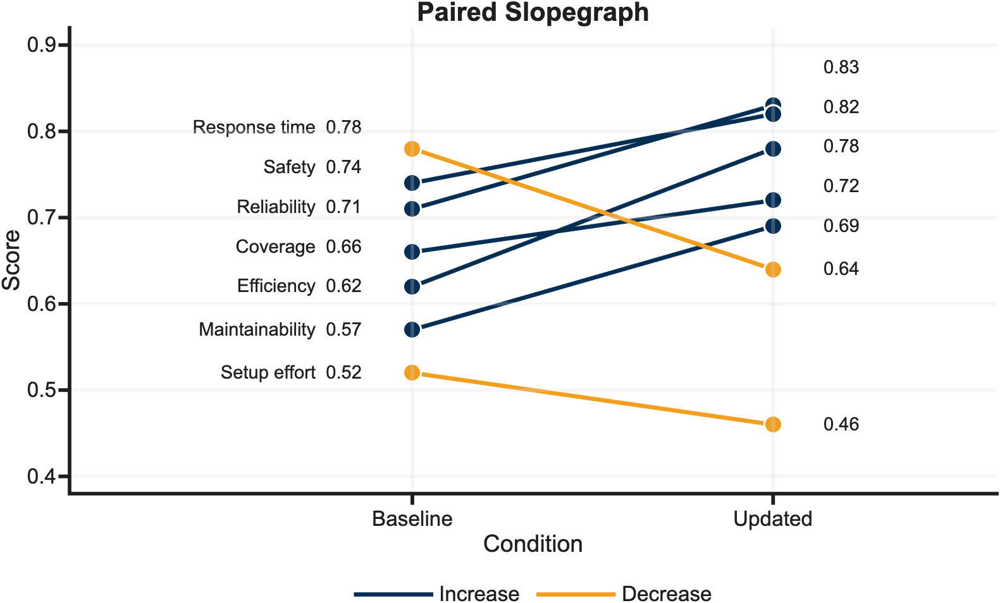
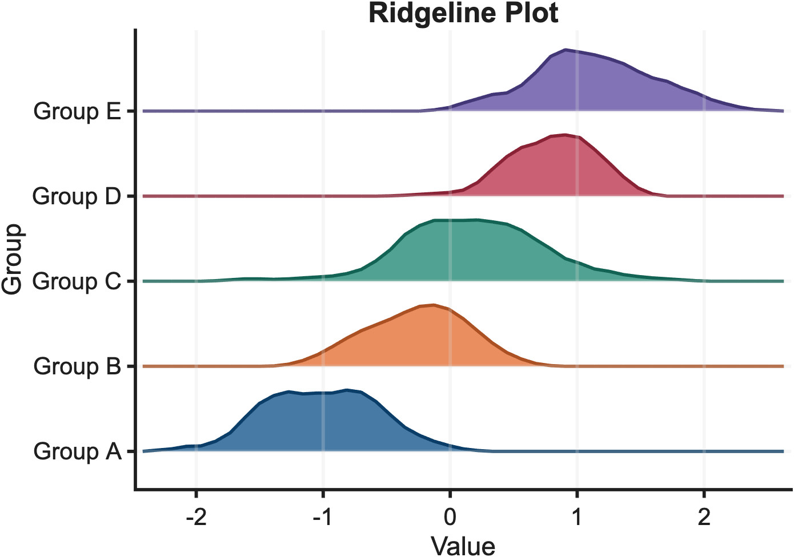
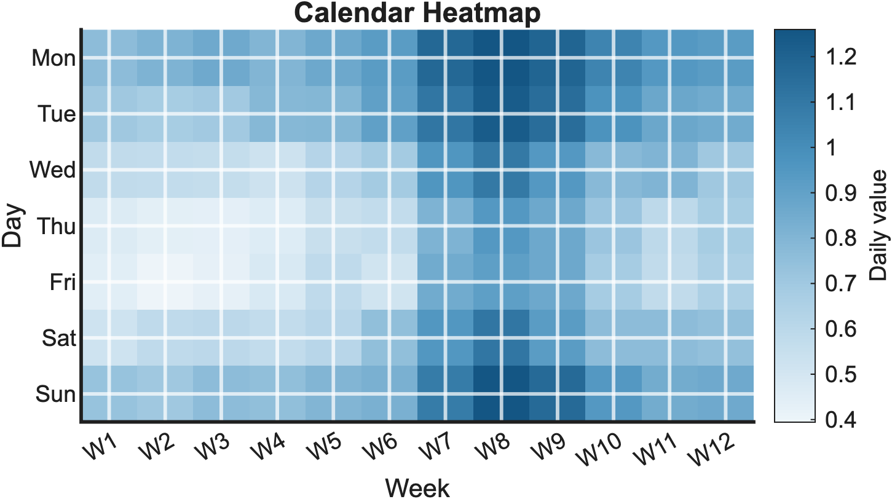

# MATLAB Scientific Figures

[](https://github.com/Kkkakania/matlab-scientific-figures/actions/workflows/quality.yml)
[](https://github.com/Kkkakania/matlab-scientific-figures/actions/workflows/figure-quality.yml)
[](https://github.com/Kkkakania/matlab-scientific-figures/releases)
[](LICENSE)

A clean-room gallery of MATLAB figure scripts.

Each example is meant to be copied: synthetic data in, publication-style PNG,
SVG, or PDF out. No private source packs, no journal screenshots, no hidden
helper archive.

## Find The Right Template

Start by listing the gallery:

```matlab
addpath(genpath('src'));
addpath(genpath('examples'));
templates = sftListTemplates()
manifest = sftTemplateManifest()
```

Search by the chart job you have in mind:

```matlab
sftFindTemplates("matrix")
sftFindTemplates(["density", "contour"])
sftFindTemplates("inset")
```

Then render only those figures:

```matlab
sftRenderExamples(["heatmap", "double_triangle_heatmap"], "gallery", ["png", "svg"]);
sftRenderMatches("matrix", "gallery", ["png", "svg"]);
```

From a shell:

```bash
MATLAB_BIN=/Applications/MATLAB_R2025a.app/bin/matlab ./scripts/render_all.sh list
MATLAB_BIN=/Applications/MATLAB_R2025a.app/bin/matlab ./scripts/render_all.sh search matrix
MATLAB_BIN=/Applications/MATLAB_R2025a.app/bin/matlab ./scripts/render_all.sh heatmap double_triangle_heatmap
MATLAB_BIN=/Applications/MATLAB_R2025a.app/bin/matlab ./scripts/render_all.sh match matrix
```

## Gallery

The gallery contains 25 examples. These 8 are a quick scan of the range.

<table>
  <tr>
    <td><br>Contour scatter</td>
    <td><br>Sankey flow</td>
    <td><br>Zoomed inset line</td>
    <td><br>Parallel coordinates</td>
  </tr>
  <tr>
    <td><br>Paired slopegraph</td>
    <td><br>Ridgeline plot</td>
    <td><br>Calendar heatmap</td>
    <td><br>Double-triangle heatmap</td>
  </tr>
</table>

Run `runAllExamples` to regenerate the full gallery locally.

The full gallery includes line plots, confidence intervals, scatter plots,
density scatter plots, contour scatter plots, grouped bars, error bars,
butterfly comparisons, paired slopegraphs, waffle charts, ridgeline plots,
signed area charts, heatmaps, double-triangle heatmaps, zoomed inset lines,
correlation bubbles, bubble matrices, calendar heatmaps, box plots with
jittered observations, radar charts, lollipop rankings, Sankey-style flows,
multi-panel layouts, parallel coordinates, and 3D surfaces.

## Quick Start

From MATLAB:

```matlab
addpath(genpath('src'));
addpath(genpath('examples'));
runAllExamples('gallery', ["png", "svg"]);
```

List, search, and render only the templates you need:

```matlab
templates = sftListTemplates();
matrixTemplates = sftFindTemplates("matrix");
sftRenderExamples(["heatmap", "radar_chart"], "gallery", ["png", "svg"]);
```

Validate one figure before exporting:

```matlab
fig = figure('Color', 'w');
plot(1:4, [1 3 2 5], 'LineWidth', 1.5);
title('Validation Example');
xlabel('Sample');
ylabel('Response');
report = sftValidateFigure(gcf);
disp(report.Passed)
```

From a shell with MATLAB installed:

```bash
matlab -batch "addpath(genpath('src')); addpath(genpath('examples')); runAllExamples('gallery')"
```

Or use the helper script:

```bash
MATLAB_BIN=/Applications/MATLAB_R2025a.app/bin/matlab ./scripts/render_all.sh
MATLAB_BIN=/Applications/MATLAB_R2025a.app/bin/matlab ./scripts/render_all.sh list
MATLAB_BIN=/Applications/MATLAB_R2025a.app/bin/matlab ./scripts/render_all.sh search density
SFT_OUTPUT_DIR=/tmp/sft-gallery MATLAB_BIN=/Applications/MATLAB_R2025a.app/bin/matlab ./scripts/render_all.sh match inset
```

Use [MATLAB CLI guide](docs/matlab-cli-guide.md) for Linux and Windows
executable paths. The helper scripts expect Bash; Windows users can use Git
Bash/WSL or call MATLAB directly with `-batch`.

Check the examples without touching the committed gallery:

```bash
MATLAB_BIN=/Applications/MATLAB_R2025a.app/bin/matlab ./scripts/validate_gallery.sh
```

## Design

- `sftTheme` keeps figure size, font, grid, and line defaults in one place.
- `sftPalette` provides categorical, sequential, and diverging palettes.
- `sftExampleData` generates deterministic synthetic data for the gallery.
- `sftExport` writes PNG, PDF, and SVG outputs from one call.
- `sftTiledFigure` creates a clean tiled layout without hand-tuning positions.
- `sftValidateFigure` catches a few common figure problems before export.
- `sftGalleryReport` batch-checks every gallery example.
- `sftListTemplates` and `sftFindTemplates` help users discover examples.
- `sftRenderExamples` renders all examples or a selected subset by name.
- `sftRenderMatches` renders every template that matches a search query.
- `sftTemplateManifest` exports machine-readable metadata for tools.
- `sftWriteTemplateManifest` writes the metadata JSON used by docs and checks.
- `runAllExamples` remains as the full-gallery compatibility entry point.

## Documentation

See [docs/README.md](docs/README.md) for the grouped documentation index.

| Guide | Purpose |
|---|---|
| [Tutorials](docs/tutorials.md) | Start from a concrete figure workflow |
| [First-use test](docs/first-use-test.md) | Try the project from a fresh clone and report useful feedback |
| [Gallery reference](docs/gallery-reference.md) | Pick a template by sight |
| [Template reference](docs/template-reference.md) | List every template, renderer, task, and tag |
| [Template manifest JSON](docs/template-manifest.json) | Machine-readable template metadata |
| [Chart selection guide](docs/chart-selection-guide.md) | Pick a chart by communication task |
| [Use with your data](docs/use-with-your-data.md) | Turn a gallery example into your own figure |
| [Recipes](docs/recipes.md) | Common copy-paste edits |
| [CSV and Excel tutorial](docs/tutorial-csv-excel-data.md) | Connect real tables to templates |
| [Paper export tutorial](docs/tutorial-paper-export.md) | Export SVG, PDF, and PNG for papers |
| [Batch rendering tutorial](docs/tutorial-batch-rendering.md) | Render many experiment figures at once |
| [Figure quality checklist](docs/figure-quality-checklist.md) | Review a figure before release |
| [Color accessibility](docs/color-accessibility.md) | Check hue, contrast, and grayscale risks |
| [Quality gates](docs/quality-gates.md) | Understand local and CI checks |
| [Maintainer dashboard](docs/maintainer-dashboard.md) | See current release, CI, feedback, and maintenance status |
| [Template author guide](docs/template-author-guide.md) | Add a new clean-room example |
| [Template review checklist](docs/template-review-checklist.md) | Review a template before merge |
| [Template backlog](docs/template-backlog.md) | See which high-value charts are planned |
| [MATLAB CLI guide](docs/matlab-cli-guide.md) | Render figures in scripts and CI-like workflows |
| [Release checklist](docs/release-checklist.md) | Check a release before tagging |
| [Release cadence](docs/release-cadence.md) | Keep versioning deliberate and slow after stabilization |
| [v0.5.0 maintenance report](docs/maintenance-report-v0.5.0.md) | Review the early hardening snapshot |
| [Provenance policy](docs/provenance-policy.md) | Keep public releases clean and auditable |
| [Maintainer workflow](docs/openai-codex-workflow.md) | Review PRs, issues, and releases consistently |
| [Roadmap](ROADMAP.md) | Track planned template and workflow milestones |
| [Version plan](docs/version-plan.md) | Understand release milestones and cadence |
| [v2 API design](docs/v2-api-design.md) | See the registry and selected-rendering API |
| [v2 migration notes](docs/v2-migration.md) | Move from direct renderer calls to the registry API |
| [v3.0.0 maintenance report](docs/maintenance-report-v3.0.0.md) | Review the v3 maintenance and usability scope |

## License And Provenance

This repository uses synthetic data and original example code. It does not ship
private archives, encrypted MATLAB files, article packs, journal image
collections, or copied third-party templates. See
`docs/provenance-policy.md` for the project rules.

Pass `["png", "pdf", "svg"]` to `runAllExamples` when local PDF exports are
needed for papers or slides.

## Figure Quality Checks

This repository dogfoods
[`matlab-figure-ci`](https://github.com/Kkkakania/matlab-figure-ci), a small
CLI/CI tool for MATLAB scientific figure repositories.

The workflow checks that gallery outputs exist and are non-empty, risky binary
or source files are not committed, privacy and provenance traces are flagged
before release, and optional MATLAB batch rendering can be enabled when MATLAB
is available. The project uses the `matlab-figures` preset from
`matlab-figure-ci` v2.4.5 for gallery-oriented checks, and the workflow prints
`mfigci rules` before the full check so the active policy is visible in CI.
Strict warning failure is available in `matlab-figure-ci`, but this repository
sets `strict.fail_on_warnings: false` so provenance warnings remain documented
through CI artifacts without blocking gallery checks.

## Requirements

- MATLAB R2020b or newer is recommended.
- MATLAB R2025a is used for local verification.
- No example requires external data files.

## Project Status

Current public release: `v3.4.0`.

Project maturity: early public project. The examples, CLI workflow, and checks
are usable today, but the repository is still collecting feedback before
claiming broad adoption or long-term ecosystem maturity.

The project is intentionally focused. New templates should arrive with
examples, deterministic data, documentation, and provenance checks.
